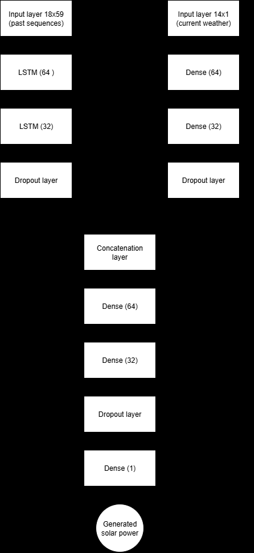
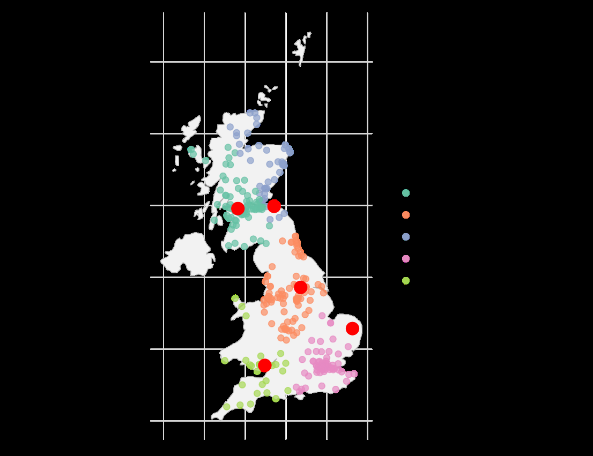
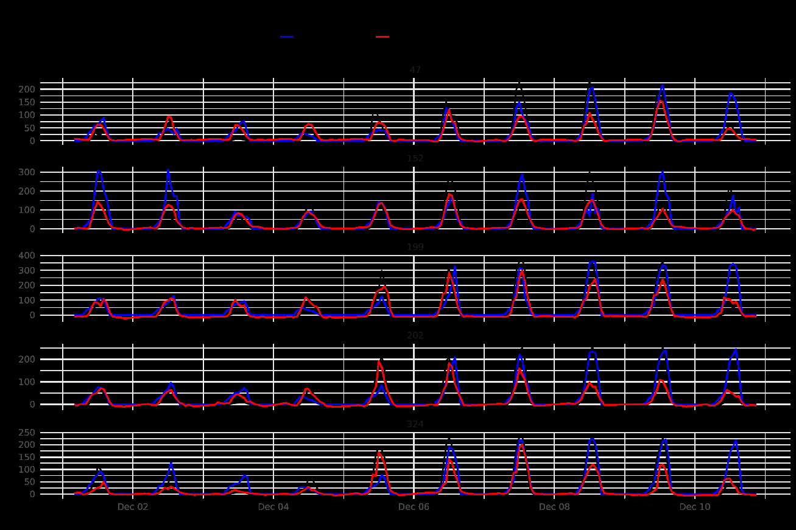
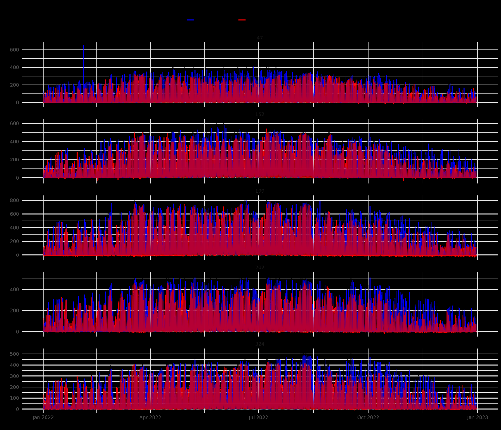
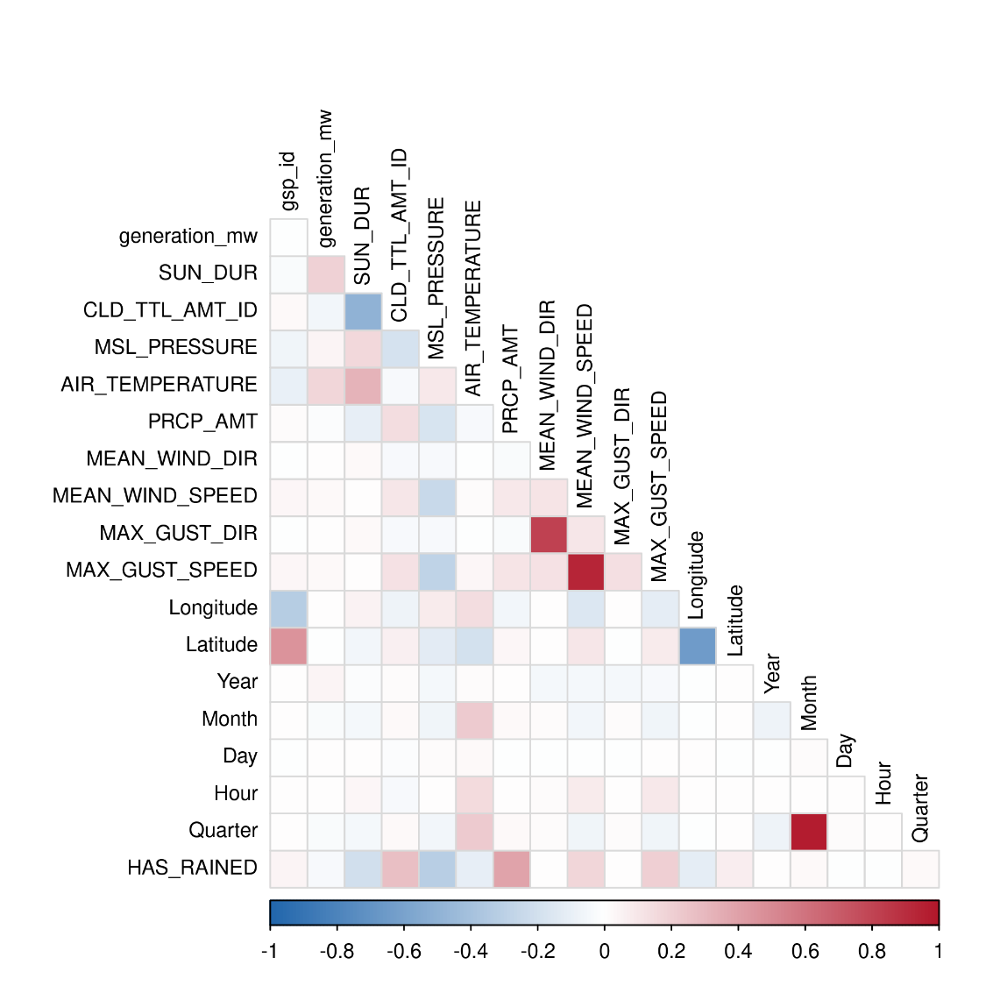
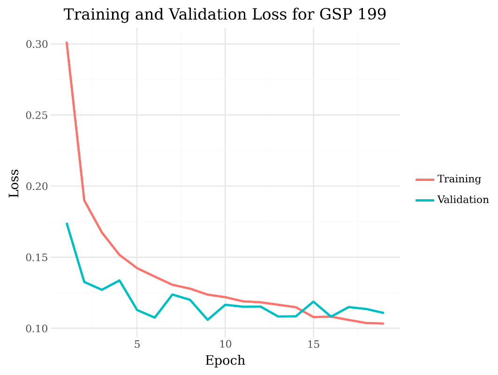

# ☀️ Solar Power Generation Forecasting

> **Bachelor's Thesis** — *Using Spatio-Temporal Data to Forecast Solar Power Generation*
> Andrea Catucci · University of Bologna · 2025

This project develops and compares **statistical** and **deep learning** models for **one-hour-ahead solar power forecasting** across the UK's 338 Grid Supply Points (GSPs). Seven years of hourly generation data (2015–2022) combined with meteorological observations are used to build interpretable and flexible forecasting systems.

---

## Motivation

Accurate solar forecasting is critical for grid management: underestimation wastes energy potential while overestimation causes supply shortages (the *Duck Curve* problem). This work benchmarks classical time-series methods against neural architectures to understand their trade-offs in accuracy, consistency, and scalability.

---

## Models

| Model | Type | Description |
|-------|------|-------------|
| **ARIMA + Fourier** | Statistical | Dynamic harmonic regression with exogenous covariates and ARIMA errors. Captures daily/yearly seasonality via Fourier terms (K_d=5, K_y=10). |
| **Linear Regression** | Baseline | PyTorch linear model with cyclical time encodings and weather features. |
| **Linear + Interactions** | Baseline | Adds hand-crafted interaction terms (sun x month, sun x cloud cover). |
| **LSTM + Weather Fusion** | Deep Learning | Two-layer LSTM encoder (18h lookback) fused with current weather via dense branch + skip connection. |
| **LSTM (No Weather)** | Ablation | Sequence-only LSTM (54h lookback) to quantify weather branch contribution. |
| **LSTM + Cross-Attention** | Experimental | Multi-head attention replaces concatenation fusion. |

### Architecture (LSTM + Weather Fusion)

<p align="center">
  
</p>

---

## Results

Evaluated on 5 representative GSPs selected via K-Means clustering to capture geographic diversity:

<p align="center">
  
</p>

### MAE (MW) — Test Year 2022

| GSP | ARIMA | LSTM |
|-----|-------|------|
| 47  | 20.92 | 23.07 |
| 152 | 18.04 | 34.49 |
| 199 | 23.50 | 36.51 |
| 202 | 18.49 | 34.05 |
| 324 | 17.97 | 23.55 |

### RMSE (MW) — Test Year 2022

| GSP | ARIMA | LSTM |
|-----|-------|------|
| 47  | 32.44 | 39.42 |
| 152 | 29.06 | 57.38 |
| 199 | 38.40 | 60.90 |
| 202 | 30.03 | 56.27 |
| 324 | 29.52 | 40.86 |

**Key findings:**
- ARIMA provides more consistent predictions, particularly during peak hours
- LSTM better captures sunrise/sunset timing across seasons but suffers from magnitude errors
- The weather fusion branch improves LSTM performance over the no-weather ablation
- Limited per-GSP training data (~46k sequences) constrains LSTM learning

### Forecast Visualisation

<p align="center">
  
  <br><em>10-day winter forecast: ARIMA (blue) vs LSTM (red) vs actual (black)</em>
</p>

<p align="center">
  
  <br><em>Full 2022 test set predictions for all 5 sample GSPs</em>
</p>

---

## Repository Structure

```
├── models/
│   ├── hourly_lstm/
│   │   ├── lstm_weather_fusion.py      # Main LSTM model (thesis architecture)
│   │   ├── lstm_no_weather.py          # Ablation: no weather branch
│   │   └── lstm_cross_attention.py     # Experimental: attention-based fusion
│   ├── hourly_linear_regression/
│   │   ├── linear_regression.py        # Baseline linear model
│   │   └── linear_regression_interactions.py  # With interaction terms
│   └── daily_glmm/
│       └── DailyModel.Rmd             # R: GLMM on PES regions (supplementary)
├── data_pipeline/
│   └── download_pvlive.py             # Script to download PV Live API data
├── figures/                           # Key figures from the thesis
├── requirements.txt
├── LICENSE
└── README.md
```

---

## Data Sources

| Source | Description | Access |
|--------|-------------|--------|
| [PV Live API](https://www.solar.sheffield.ac.uk/pvlive/) | Hourly solar generation per GSP (2015-2022) | Open (via `pvlive-api` package) |
| [MIDAS](https://catalogue.ceda.ac.uk/uuid/dbd451271eb04662beade68da43546e1) | UK hourly weather observations (temperature, cloud, wind, rain, sunshine) | CEDA registration required |
| GSP metadata | Coordinates, capacity, region boundaries | [ESO Data Portal](https://data.nationalgrideso.com/) |

> **Note:** Raw data files are not included due to size. Use `data_pipeline/download_pvlive.py` for generation data. Weather data requires CEDA access.

---

## Setup

```bash
# Clone and set up environment
git clone https://github.com/<your-username>/SolarPowerProductionPrediction.git
cd SolarPowerProductionPrediction

python -m venv .venv
source .venv/bin/activate  # On Windows: .venv\Scripts\activate
pip install -r requirements.txt
```

### Running the LSTM model

```bash
# Download generation data (requires pvlive-api)
python data_pipeline/download_pvlive.py --start 2015-01-01 --end 2022-12-31

# Train LSTM for a specific GSP
python models/hourly_lstm/lstm_weather_fusion.py data_for_lstm.feather --gsp-id 199
```

---

## Exploratory Analysis

<p align="center">
  
  <br><em>Correlation matrix showing relationships between weather covariates and generation</em>
</p>

<p align="center">
  
  <br><em>Training and validation loss curves across GSPs showing learning dynamics</em>
</p>

---

## Future Directions

- **Multi-GSP training** — Train a single model across all 338 GSPs with learned embeddings
- **Hybrid ensemble** — Weight ARIMA during peak hours, LSTM at sunrise/sunset
- **Graph Neural Networks** — Exploit spatial structure between neighbouring GSPs
- **Larger training data** — Use the full 19M row dataset to reduce overfitting

This repository represents my academic thesis research. For this scope, models were trained on a localized subset of 50,000 rows representing a single GSP to establish architectural viability. The LSTM performance highlighted the limitations of isolated time-series forecasting.
Ideally, I would have utilized the full 20-million row dataset, pivoting away from isolated LSTMs and implementing a Spatio-Temporal Graph Neural Network (STGNN) to capture the spatial movement of weather covariates across the grid. However, I could only use a subset of the training data I built due to hardware constraints. 
---

## Citation

If you use this work, please cite:

```
Catucci, A. (2025). Using Spatio-Temporal Data to Forecast Solar Power Generation.
Bachelor's Thesis, University of Bologna.
```

---

## License

This project is licensed under the MIT License — see [LICENSE](LICENSE) for details.
